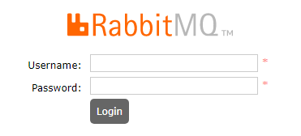

# RabbitMQ

## 1. 基于Docker安装RabbitMQ

### 1.1 搜索镜像

```
docker search rabbitmq:3.12.0-management
```

### 1.2 下载镜像

```
docker pull rabbitmq:3.12.0-management
```

### 1.3 创建并运行容器

```
docker run -d --name rabbitmq3.12.0 -p 5672:5672 -p 15672:15672 -e RABBITMQ_DEFAULT_USER=admin -e RABBITMQ_DEFAULT_PASS=12345 rabbitmq:3.12.0-management
```

+ `-d`：后台运行
+ `--name rabbitmq3.12.0`：容器名称
+ `-p 5672:5672`
+ `-p 15672:15672`
+ `-e RABBITMQ_DEFAULT_USER=admin`：管理用户
+ `-e RABBITMQ_DEFAULT_PASS=12345`：管理用户名
+ `rabbitmq:3.12.0-management`：镜像

### 1.4 查看运行的容器

```
docker ps
```

### 1.5 登录验证

在浏览器中输入`http://<ip>:15672`, 输入用户名`admin`，输入密码`12345`, 成功登录。



## 2. Hello World - 生产者和消费者

### 2.1 生产者

```
// 1. 创建连接工厂
ConnectionFactory factory = new ConnectionFactory();
factory.setHost("192.168.2.108");
factory.setPort(5672);
factory.setUsername("admin");
factory.setPassword("12345");

Connection conn = null;
Channel channel = null;

try {
    // 2. 从连接工厂获取连接
    conn = factory.newConnection("Producer");

    // 3.从连接中获取通道
    channel = conn.createChannel();

    String queueName = "Queue01";

    // 4. 声明队列，不存在则创建
    channel.queueDeclare(
            queueName,  // 队列名称
            false,          // 队列是否支持持久化
            false,          // 是否排他，即是否为私有。如果为True，会对当前队列加锁，其它通道不能访问，并且在连接关闭时自动删除，不受持久化和自动删除
            false,          // 是否自动删除，当最后一个消费者断开连接之后，是否自动删除
            null            // 队列参数，设置队列有效期、消息最大长度、队列中所有消息的声明周期等
    );

    // 5. 发送消息
    channel.basicPublish("", queueName, null, "Hello World".getBytes());

} catch (IOException ex) {
    log.error("{}", ex.getMessage(), ex);
} catch (TimeoutException ex) {
    log.error("{}", ex.getMessage(), ex);
} finally {
    if(Objects.nonNull(channel) && channel.isOpen()) {
        try {
            channel.close();
        } catch (IOException ex) {
            log.error("{}", ex.getMessage(), ex);
        } catch (TimeoutException ex) {
            log.error("{}", ex.getMessage(), ex);
        }
    }

    if(Objects.nonNull(conn) && conn.isOpen()) {
        try {
            conn.close();
        } catch (IOException ex) {
            log.error("{}", ex.getMessage(), ex);
        }
    }
}
```

### 2.2 消费者

```
// 1. 创建连接工厂
ConnectionFactory factory = new ConnectionFactory();
factory.setHost("192.168.2.108");
factory.setPort(5672);
factory.setUsername("admin");
factory.setPassword("12345");

Connection conn = null;
Channel channel = null;

try {
    // 2. 从连接工厂获取连接
    conn = factory.newConnection("Consumer");

    // 3.从连接中获取通道
    channel = conn.createChannel();

    String queueName = "Queue01";

    // 4. 监听队列
    channel.basicConsume(
            queueName,  // 队列名称
            true,       // 是否自动确认
            new DeliverCallback() {     // 接受消息后的业务处理
                @Override
                public void handle(String consumerTag, Delivery message) throws IOException {
                    log.warn("收到消息：{}", new String(message.getBody(), Charset.forName("UTF-8")));
                }
            },
            new CancelCallback() {
                @Override
                public void handle(String consumerTag) throws IOException {
                    log.warn("cancel - {}", consumerTag);
                }
            });

} catch (IOException ex) {
    log.error("{}", ex.getMessage(), ex);
} catch (TimeoutException ex) {
    log.error("{}", ex.getMessage(), ex);
} finally {
    if(Objects.nonNull(channel) && channel.isOpen()) {
        try {
            channel.close();
        } catch (IOException ex) {
            log.error("{}", ex.getMessage(), ex);
        } catch (TimeoutException ex) {
            log.error("{}", ex.getMessage(), ex);
        }
    }

    if(Objects.nonNull(conn) && conn.isOpen()) {
        try {
            conn.close();
        } catch (IOException ex) {
            log.error("{}", ex.getMessage(), ex);
        }
    }
}
```


